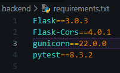
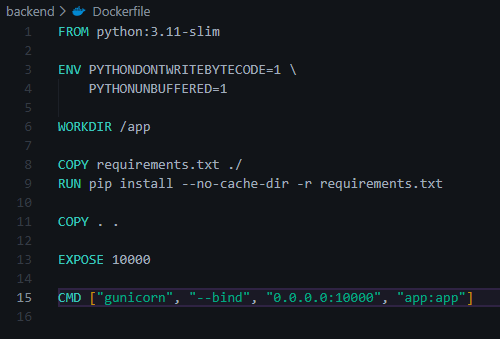
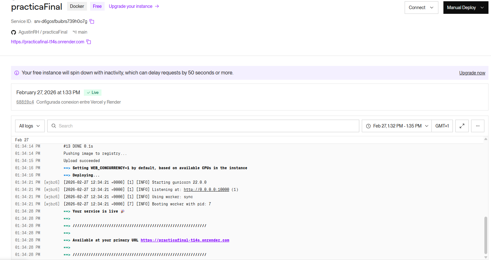
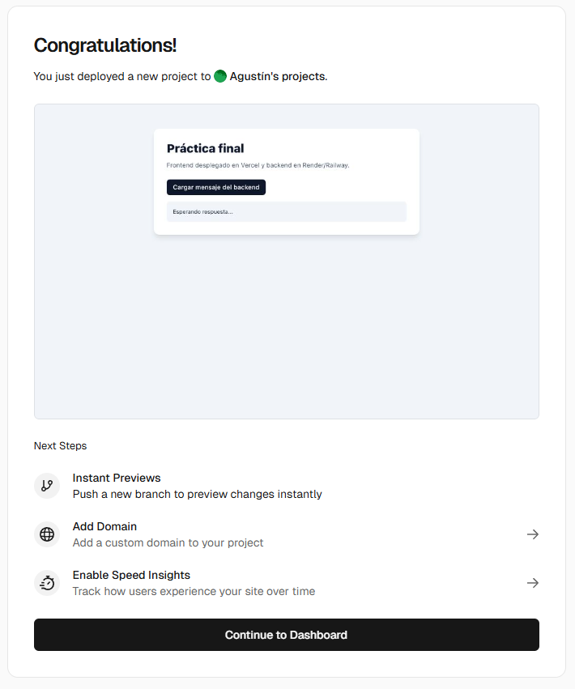
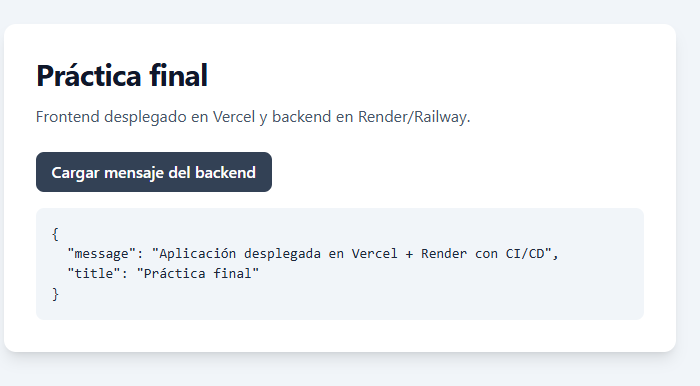
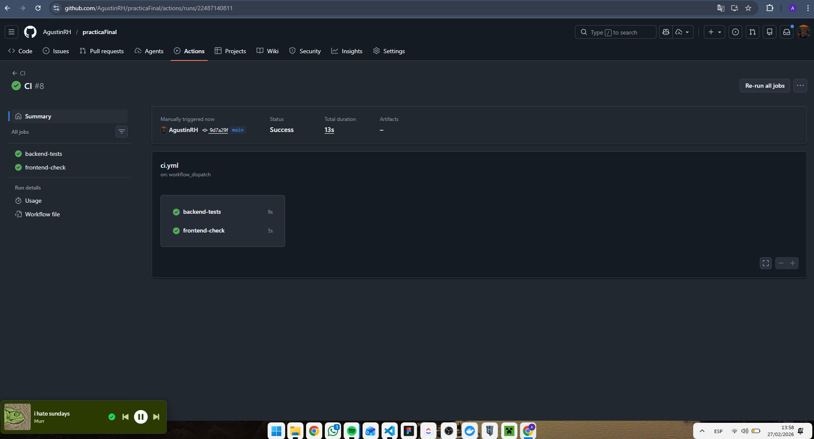
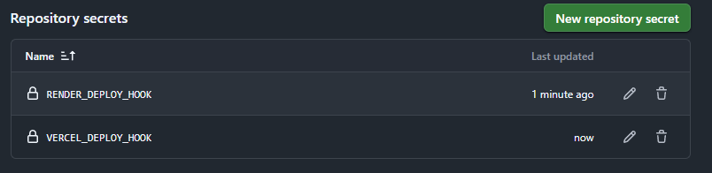

# Práctica final: Despliegue de una aplicación propia en Vercel, Render y Railway con CI/CD

Este proyecto se desarrolló en dos carpetas principales:

- `backend`: API en Flask con `requirements.txt` y `Dockerfile`.
- `frontend`: aplicación web estática con Tailwind CSS.

## Estructura del proyecto

```bash
practicaFinal/
├── backend/
│   ├── app.py
│   ├── Dockerfile
│   ├── requirements.txt
│   └── tests/
├── frontend/
│   ├── index.html
│   ├── script.js
│   └── vercel.json
├── img/
├── .github/workflows/
│   ├── ci.yml
│   └── deploy.yml
├── render.yaml
└── railway.toml
```

---

## Backend (paso a paso)

### 1) Crear la API con Flask

Se creó `backend/app.py` con dos endpoints:

- `GET /api/health`
- `GET /api/message`

### 2) Definir dependencias

Se agregó `backend/requirements.txt` con Flask, CORS, Gunicorn y Pytest.



### 3) Dockerizar el backend

Se creó `backend/Dockerfile` para construir y ejecutar el servicio en contenedor.



### 4) Probar localmente

Desde `backend/`:

```bash
python -m venv .venv
source .venv/bin/activate
pip install -r requirements.txt
python app.py
```

### 5) Desplegar backend en Render

Se conectó el repositorio en Render y se desplegó usando Docker con raíz en `backend`.

URL desplegada:

- https://practicafinal-t14s.onrender.com/

Evidencia:



### 6) Preparar despliegue en Railway

Se añadió `railway.toml` para desplegar también el backend con Docker en Railway.

---

## Frontend (paso a paso)

### 1) Crear interfaz web

Se implementó `frontend/index.html` con Tailwind CSS y un botón para consultar el backend.

### 2) Conectar frontend con backend

En `frontend/script.js` se configuró la URL del backend desplegado en Render:

- `https://practicafinal-t14s.onrender.com`

### 3) Configurar Vercel

Se añadió `frontend/vercel.json` y se desplegó el frontend con `Root Directory = frontend`.

URL desplegada:

- https://practica-final-blond.vercel.app/

Evidencia:



### 4) Resultado final integrado

El frontend consume correctamente el backend y muestra la respuesta de la API.



---

## CI/CD con GitHub Actions

### 1) Integración continua (CI)

En `.github/workflows/ci.yml` se configuró:

- pruebas del backend con `pytest`;
- validación de archivos clave del frontend.

Evidencia de ejecución del workflow:



### 2) Despliegue continuo (CD)

En `.github/workflows/deploy.yml` se configuró el disparo por `push` a `main` mediante Deploy Hooks para:

- Render
- Vercel

Secrets usados en GitHub:

- `RENDER_DEPLOY_HOOK_URL`
- `VERCEL_DEPLOY_HOOK_URL`


